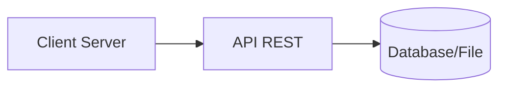

# Projeto Node Client Server

<p align="center">
  Aplicação desenvolvida com <strong>Node.js</strong> utilizando arquitetura
  <strong>Client-Server</strong>, com renderização dinâmica, rotas e integração
  com uma API REST separada.
</p>

<p align="center">
  
  
  
</p>


---

## Demonstração

<p align="center">
  
</p>

---


# Sobre o projeto

Este projeto foi desenvolvido para praticar conceitos de:

- Arquitetura Client-Server
- Node.js e Express
- Rotas dinâmicas
- Renderização de páginas
- Consumo de API REST
- Organização backend

A aplicação funciona em conjunto com um segundo projeto responsável pelas rotas da API REST:

📂 `Projeto-Restful`

---

# 📂 Estrutura do projeto

```bash
Projeto-Node-Client-Server
┣ 📂 client-server
┃ ┣ 📂 assets
┃ ┣ 📂 routes
┃ ┣ 📂 views
┃ ┣ 📜 index.js
┃ ┗ 📜 package.json
┃
┣ 📂 Projeto-Restful
┃ ┣ 📂 routes
┃ ┣ 📂 utils
┃ ┣ 📜 index.js
┃ ┣ 📜 users
┃ ┗ 📜 package.json
┃
┗ 📜 README.md
```

---

# Importante

Para que as rotas da aplicação funcionem corretamente, é necessário executar:

- ✅ O servidor principal (`client-server`)
- ✅ A API REST (`Projeto-Restful`)

Os dois projetos precisam estar rodando simultaneamente.

---

# Funcionalidades

- ✅ Servidor Express
- ✅ Rotas dinâmicas
- ✅ Renderização de páginas
- ✅ Estrutura MVC básica
- ✅ Middleware
- ✅ API REST integrada
- ✅ Arquivos estáticos

---

# Tecnologias utilizadas

| Tecnologia | Descrição |
|------------|------------|
| Node.js | Ambiente backend |
| Express.js | Framework web |
| JavaScript | Linguagem da aplicação |
| HTML/CSS | Interface |
| EJS / Views | Renderização dinâmica |
| REST API | Comunicação backend |

---

# Como executar o projeto

## Clone o repositório

```bash
git clone https://github.com/lucasescouto-ux/Projeto-Node-Client-Server.git
```

---

# Executando o Client Server

```bash
cd client-server

npm install

npm start
```

Servidor disponível em:

```bash
http://localhost:3000
```

---

# Executando a API REST

Abra outro terminal:

```bash
cd Projeto-Restful

npm install

npm start
```

API disponível em:

```bash
http://localhost:4000
```

---

# Comunicação entre os projetos

O projeto `client-server` consome dados e rotas fornecidas pelo projeto `Projeto-Restful`.

Fluxo da aplicação:



---

# Aprendizados

Neste projeto foram praticados conceitos como:

- Arquitetura Client-Server
- APIs REST
- Express.js
- Middleware
- Estruturação backend
- Comunicação entre aplicações
- Renderização dinâmica

---

<p align="center">
  ⭐ Projeto RESTful API - Trilha Saipos
</p>